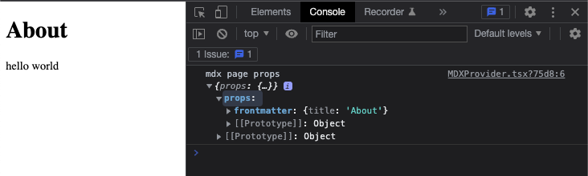

# Next.js with MDX Pages



Includes [`recma-mdx-frontmatter`](./plugins/recma-mdx-frontmatter.mjs) plugin to feed frontmatter variables created by [`remark-mdx-frontmatter`](https://www.npmjs.com/package/remark-mdx-frontmatter) to provider as static props

```tsx
// components/MDXProvider.tsx
import Layout from './Layout'
import { MDXProvider as StockMDXProvider } from '@mdx-js/react'
import type { PropsWithChildren } from 'react'

const wrapper = ({ children, frontmatter }) => {
  console.log('mdx page props', { props: { frontmatter } })
  return <Layout frontmatter={frontmatter}>{children}</Layout>
}

const shortcodes = {
  wrapper,
}

type MDXProviderProps = PropsWithChildren<{}>

function MDXProvider({ children }: MDXProviderProps) {
  return <StockMDXProvider components={shortcodes}>{children}</StockMDXProvider>
}

export default MDXProvider
```
